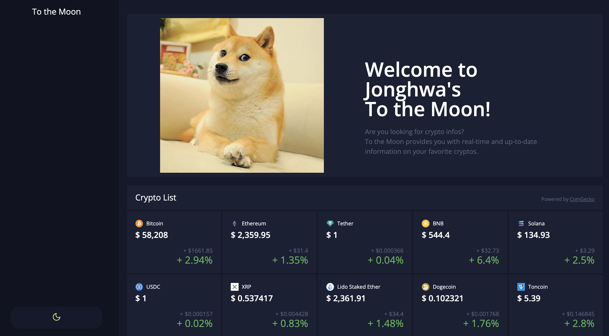

# Crypto-Tracker Clone
React Challenge with Coingecko API

## 🔗 Demo
https://jonghwa3471.github.io/react-coingecko-crypto-tracker/

## 🖥 Preview

## 🔥 Stack

### Front-end

  

### Deploy

## ✅ Packages

- [x] React
- [x] TypeScript
- [x] Styled-components
- [x] Coingecko API
- [x] Apexcharts

## 📖 Theory

- [x] Fetching Data
- [x] Implement Chart
- [x] Dark Mode
- [x] Handle Loading
- [x] Data Format

## 📱 View

- [x] Home
- [x] More Info
- [x] Price Chart
- [x] Price Candle Chart
- [x] Dark Mode Button
